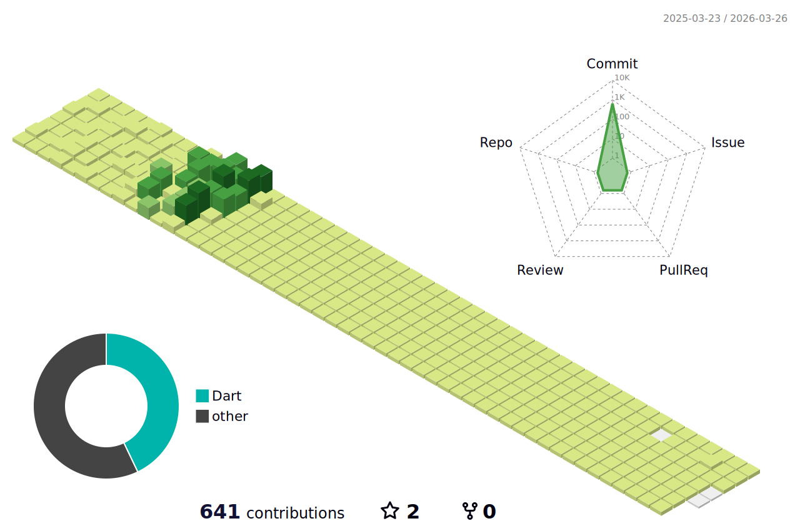

  
### 신입 flutter 개발자 이정원입니다!

### 🖥️Introduce
🏫2022.03~ 건국대학교 글로컬캠퍼스 20학번 ICT융합공학부 소프트웨어전공 재학중
  
안녕하세요, 지난 2년 동안 Flutter를 활용하여 웹 및 모바일 애플리케이션 개발을 배우고, Rive 등 다양한 기술을 습득해, 
현재는 두 개의 앱 프로젝트를 곧 출시할 예정인 신입 개발자 이정원입니다. 
새로운 기회에 대해 큰 기대와 열정을 가지고 있으며, 앞으로 더 많은 경험을 쌓고 성장하고자 합니다!
 

### ✉️Contact

 

 

### 🏕️Bootcamp
☁️9oormthon Training IN Goorm 자바스프링 & 리액트 풀스택 개발자 성장 과정 1회차 수료

 

### 🔧 Stacks

#### 🥰Main

#### ☺️Platform

#### 😉Communication Tools

#### 😎Develop Tools

  

<!--  -->

 
